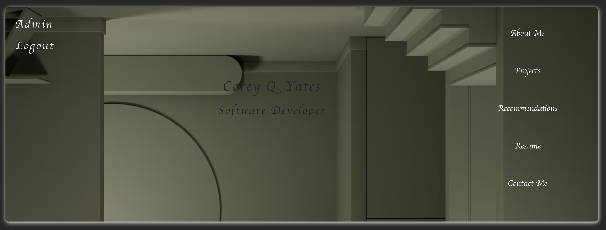

# Developer-Portfolio

Take a look at my beautiful developer's portfolio.  If you want to send me a message or leave a recommendation, there are forms to do so.  There is also an admin panel for my own personal use to approve recommendations and track messages.

+ notes to self: added a development branch on 6/28/2024 to protect the render deployment on the main.